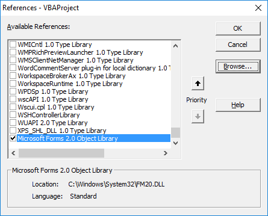

# RedditTableMacro
Converts a selected range in Excel to Reddit Table Format

Uses the text alignment of the top row to determine if the text should be centered, left aligned, or right aligned

## Installation
* Copy contents of RedditTable.vba to new macro
* Macro requires Microsoft Forms 2.0 Object Library, it will likely need to be added manually from Tools => References => Browse => FM20.dll.  See screenshots below for example.

